# Explore o machine learning automatizado no Azure

Este é um tutorial de estudo solicitado pela Digital Innovation One - [DIO](https://www.dio.me/) para praticar os conceitos aprendidos no curso de 
Introdução ao Aprendizado de Máquina' [Microsoft Azure AI Fundamentals](https://web.dio.me/track/microsoft-azure-ai-fundamentals).

Neste exercício, usaremos o recurso de aprendizado de máquina automatizado no Azure Machine Learning para treinar e avaliar um modelo de aprendizado de máquina. Em seguida, você implantará e testará o modelo treinado.

## Pré-requisitos

* Ter uma conta no Microsoft Azure.

#### Se você não possui conta no Microsoft Azure siga os passos abaixo:

* Acesse o site da [Microsoft Azure](https://azure.microsoft.com/pt-br)
* Clique em Experimente gratuitamente.
* Será necessário colocar os dados de sua conta da Microsoft, caso não possua criar.
* Será necessário cadastrar um cartão de crédito para aderir ao plano gratuito.
* Você terá $200 dólares de crédito ou 30 dias para testar os serviços.

## Explorando Azure Machine Learning

1. Entre no [Portal da Azure](https://portal.azure.com) com suas credenciais da Microsoft.

2. Na aba Azure Services procure por 'Criar recurso'.

3. pesquise Machine Learning

4. crie um novo recurso do Azure Machine Learning

5. Realizar a seguintes configurações conforme abaixo:

        Assinatura: sua assinatura do Azure
        Grupo de recursos: Crie ou selecione um grupo de recursos
        Nome: Insira um nome exclusivo para seu espaço de trabalho
        Região: Selecione a região geográfica mais próxima
        Conta de armazenamento: Criado automaticamente
        Cofre de chaves: Criado automaticamente
        Insights de aplicativo: Criado automaticamente
        Registro de contêiner: Nenhum 

6. Selecione Revisar + criar e selecione Criar . Aguarde a criação do seu espaço de trabalho (pode demorar alguns minutos) e, em seguida, vá para o recurso implantado.

7. Selecione Launch Studio (ou abra uma nova guia do navegador e navegue até https://ml.azure.com e entre no Azure Machine Learning Studio usando sua conta da Microsoft). Feche todas as mensagens exibidas.

8. No estúdio Azure Machine Learning, você deverá ver seu espaço de trabalho recém-criado. Caso contrário, selecione Todos os espaços de trabalho no menu à esquerda e selecione o espaço de trabalho que você acabou de criar.

9. Na página que abrir você deverá localizar no meu lateral esquerdo a opção 'ML Automatizado', caso o menu não esteja expadindo aparecendo os nomes, clique no ícone do menu para expandir.

10. Clique em 'Novo trabalho de ML automatizado' e em seguida insira estas informações abaixo:


### Configurações Básicas:

    Nome do Trabalho: mslearn-bike-automl
    Novo nome do experimento: mslearn-bike-rental
    Descrição: Aprendizado de máquina automatizado para previsão de aluguel de bicicletas
    Marcas: Não adicionar nenhum.


### Tipo de tarefa e dados :    
* Selecione o tipo de tarefa : Regressão
* Selecionar conjunto de dados : crie um novo conjunto de dados com as seguintes configurações:

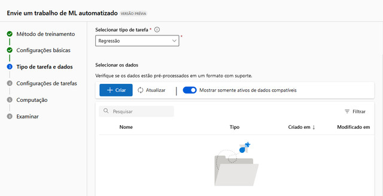

### Tipo de dados :

    Nome: aluguel de bicicletas
    Descrição: dados históricos de aluguel de bicicletas
    Tipo: Tabular

 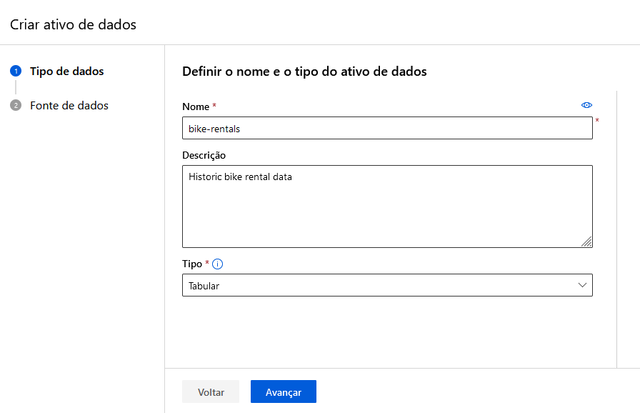   

### Fonte de dados:

    Selecione arquivos da web
    URL da Web :https://aka.ms/bike-rentals
    Ignorar validação de dados : não selecionar

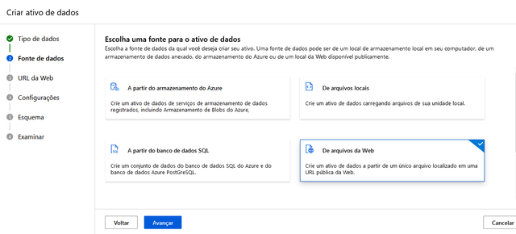    
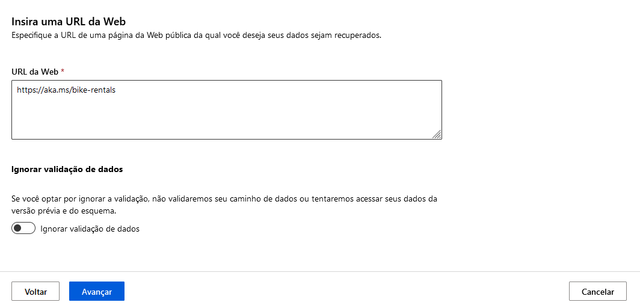

### Configurações :

    Formato de arquivo: Delimitado
    Delimitador: Vírgula
    Codificação: UTF-8
    Cabeçalhos de coluna: apenas o primeiro arquivo possui cabeçalhos
    Pular linhas: Nenhum
    O conjunto de dados contém dados multilinhas: não selecione

 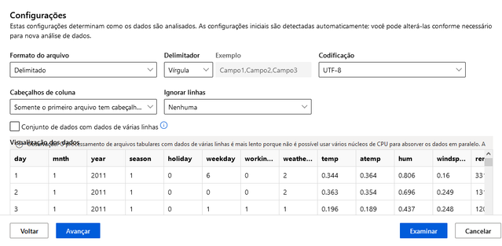   

### Esquema :

    Incluir todas as colunas exceto Caminho
    Revise os tipos detectados automaticamente

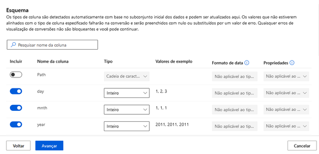    

11. Selecione Criar

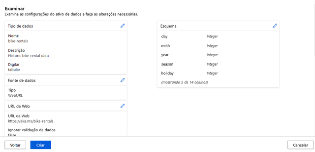

12. Após a criação do conjunto de dados, selecione o conjunto de dados de aluguel de bicicletas para continuar a enviar o trabalho de ML automatizado.

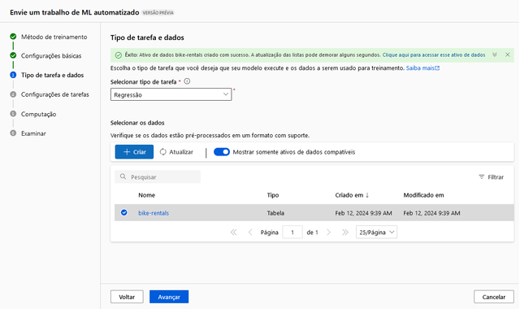


### Configurações de tarefa :

    Tipo de tarefa : Regressão
    Conjunto de dados : aluguel de bicicletas
    Coluna de destino : Aluguéis (inteiro)

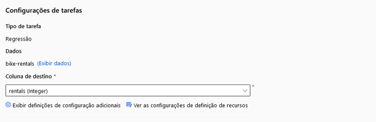

### Configurações adicionais :

    Métrica primária : raiz do erro quadrático médio normalizado
    Explique o melhor modelo : Não selecionado
    Usar todos os modelos suportados : Desmarcado . Você restringirá o trabalho para tentar apenas alguns algoritmos específicos.
    Modelos permitidos : Selecione apenas RandomForest e LightGBM — normalmente você gostaria de tentar o máximo possível, mas cada modelo adicionado aumenta o tempo necessário para executar o trabalho.

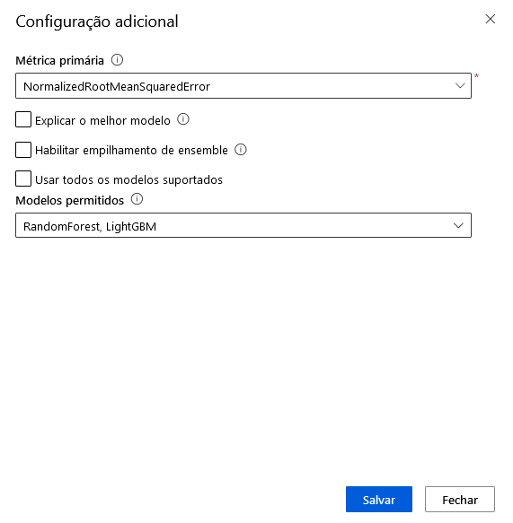    


### Limites : expanda esta seção

    Máximo de testes : 3
    Máximo de testes simultâneos : 3
    Máximo de nós : 3
    Limite de pontuação da métrica : 0,085 ( para que, se um modelo atingir uma pontuação da métrica de erro quadrático médio normalizado de 0,085 ou menos, o trabalho termina. )
    Tempo limite : 15
    Tempo limite de iteração : 15
    Habilitar rescisão antecipada : selecionado

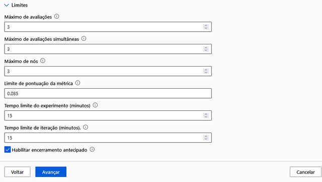


### Validação e teste :

    Tipo de validação : divisão de validação de trem
    Porcentagem de dados de validação : 10
    Dados de teste : Nenhum

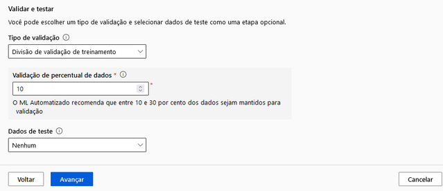


### Computação :

    Selecione o tipo de computação : sem servidor
    Tipo de máquina virtual : CPU
    Camada de máquina virtual : Dedicada
    Tamanho da máquina virtual : Standard_DS3_V2*
    Número de instâncias : 1

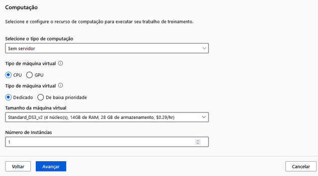

13. Envie o trabalho de treinamento. Ele inicia automaticamente.

# Implantar e testar o modelo

1. Na guia Modelo, selecione Implantar e use a opção de serviço Web para implantar o modelo com as seguintes configurações:

        Nome : prever-aluguéis
        Descrição : Prever aluguel de bicicletas
        Tipo de computação : Instância de Contêiner do Azure
        Habilitar autenticação : selecionado

2. Aguarde o início da implantação(isso pode levar alguns segundos).
 O status de implantação do endpoint de previsão de aluguel será indicado na parte principal da página como Running .
Aguarde até que o status da implantação mude para Succeeded . Isso pode levar de 5 a 10 minutos.

# Testando o serviço implantado

1. Após a conclusão da criação do ponto de extremidade, você deverá clica no menu lateral em ponto de extremidade, 

2. selecionar então o ponto de extremidade criado e clicar em testar.

3. No painel Dados de entrada para testar o endpoint , substitua o modelo JSON pelos seguintes dados de entrada:
    ```
    {
      "Inputs": { 
        "data": [
          {
            "day": 1,
            "mnth": 1,   
            "year": 2022,
            "season": 2,
            "holiday": 0,
            "weekday": 1,
            "workingday": 1,
            "weathersit": 2, 
            "temp": 0.3, 
            "atemp": 0.3,
            "hum": 0.3,
            "windspeed": 0.3 
          }
        ]    
      },   
      "GlobalParameters": 1.0
    }
    ```

4. Clique no botão Testar   


# Deletando os serviços após o uso

O serviço web que você criou está hospedado em uma instância de contêiner do Azure . Se não pretender usa-lo, deverá eliminar para evitar utilização desnecessária do Azure.

No estúdio Azure Machine Learning , na guia Endpoints , selecione o ponto de extremidade de previsão de aluguel . Em seguida, selecione Excluir e confirme que deseja excluir o endpoint.

Excluir as instâncias não utilizadas garante que sua assinatura não será cobrada por recursos..

Para excluir seu espaço de trabalho:

No portal Azure , na página Grupos de recursos , abra o grupo de recursos que especificou ao criar o seu espaço de trabalho Azure Machine Learning.
Clique em Excluir grupo de recursos , digite o nome do grupo de recursos para confirmar que deseja excluí-lo e selecione Excluir .