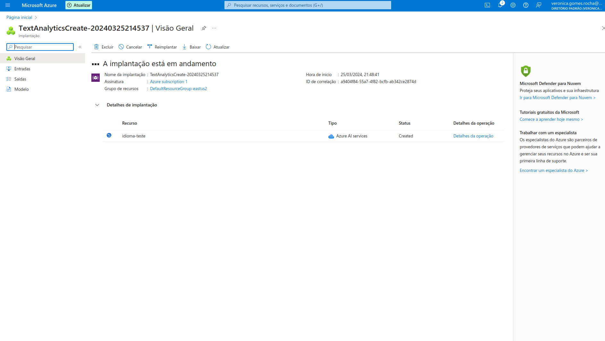
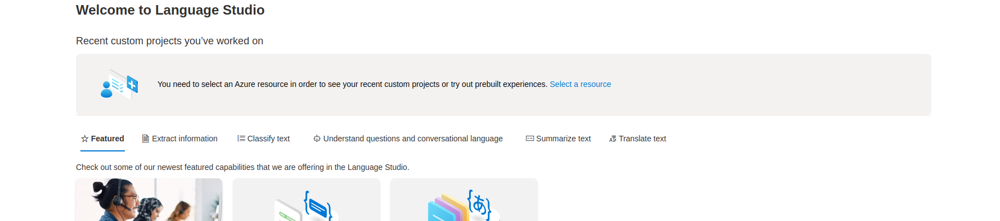
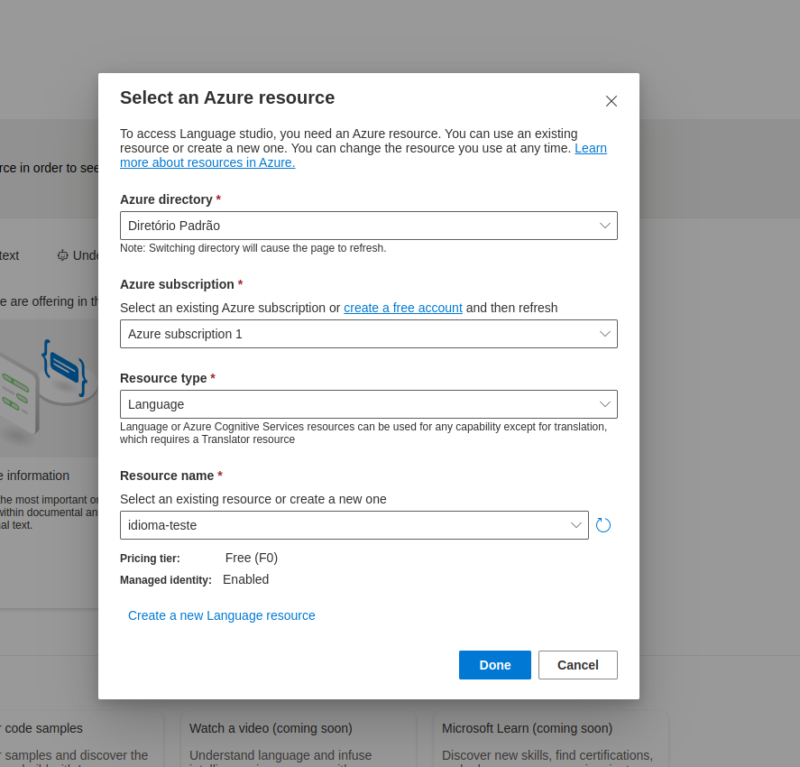
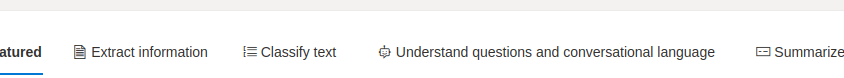
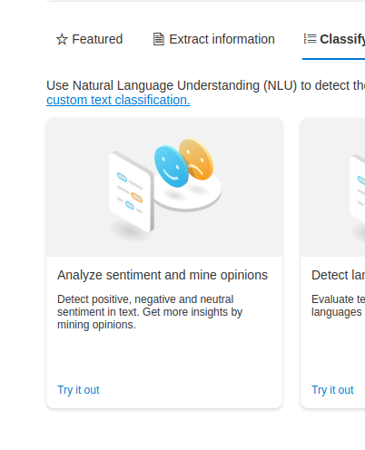
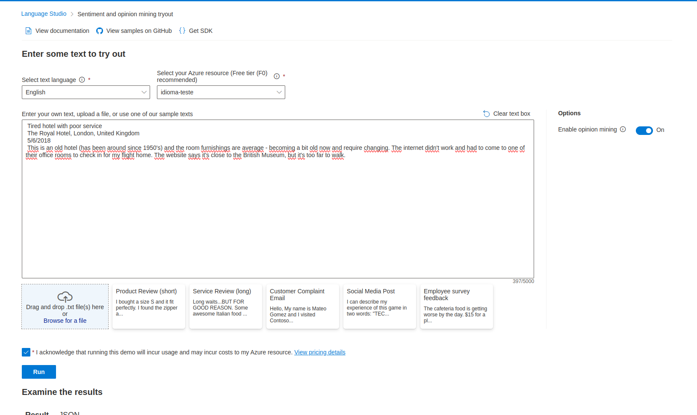

# Explore Language Studio Azure

Este é um tutorial de estudo solicitado pela Digital Innovation One - [DIO](https://www.dio.me/) para praticar os conceitos aprendidos no curso de 
Introdução ao Aprendizado de Máquina' [Microsoft Azure AI Fundamentals](https://web.dio.me/track/microsoft-azure-ai-fundamentals).

Neste exercício, você explorará os recursos da linguagem Azure AI analisando alguns exemplos de avaliações.

## Pré-requisitos

* Ter uma conta no Microsoft Azure.

#### Se você não possui conta no Microsoft Azure siga os passos abaixo:

* Acesse o site da [Microsoft Azure](https://azure.microsoft.com/pt-br)
* Clique em Experimente gratuitamente.
* Será necessário colocar os dados de sua conta da Microsoft, caso não possua criar.
* Será necessário cadastrar um cartão de crédito para aderir ao plano gratuito.
* Você terá $200 dólares de crédito ou 30 dias para testar os serviços.

## Explorando Azure Language Studio

1. Entre no [Portal da Azure](https://portal.azure.com) com suas credenciais da Microsoft.

2. Na aba Azure Services procure por 'Criar recurso'.

3. Em categorias selecione o item IA + Machine Learning.

4. No item Análise de texto clique em criar

5. Ao ser direcionado para a pagina abaixo, clique em "continue to create your resource"

6. Abrirá um painel com algumas informações para preencher

        Assinatura: sua assinatura do Azure
        Grupo de recursos: Crie ou selecione um grupo de recursos da sua assinatura
        Nome: Insira um nome exclusivo para seu espaço de trabalho
        Região: Selecione a região geográfica mais próxima
        Tipo de preço: free F0
        Clicar em examinar e criar

Recurso em implantação

7. Após a criação do recurso acessar o [Portal da Language Studio Azure](https://language.cognitive.azure.com/home) com suas credenciais da Microsoft. .

8. Clicar em "Select resource"

9. Preencha conforme imagem e selecione o seu resource e clique em "done"

10. Na pagina inicial selecionar a opção "Classify text".

11. Selecionar o card Analyze sentiment and mine opinions.

Obs: Se aparecer o error: BadRequestInvalidResource - Visio studio, aguarde alguns minutes e tente novamente.

### Analyze sentiment and opinions
Agora trabalharemos com analise de textos e opniẽs

1. Colocar um texto de exemplo, pode usar o exemplo da [documentação](https://microsoftlearning.github.io/mslearn-ai-fundamentals/Instructions/Labs/06-text-analysis.html).

        "Tired hotel with poor service
        The Royal Hotel, London, United Kingdom
        5/6/2018
        This is an old hotel (has been around since 1950's) and the room furnishings are average - becoming a bit old now and require changing. The internet didn't work and had to come to one of their office rooms to check in for my flight home. The website says it's close to the British Museum, but it's too far to walk."
        

2. clicar em run e será geradao a analise
  

# Deletando os serviços após o uso

O serviço web que você criou está hospedado em uma instância de contêiner do Azure . Se não pretender usa-lo, deverá eliminar para evitar utilização desnecessária do Azure.

Na pagina inicial do azure selecionar todos os recursos.

Excluir as instâncias não utilizadas, pois isso garante que sua assinatura não será cobrada por recursos..

Para excluir seu espaço de trabalho:

No portal Azure , na página Grupos de recursos , abra o grupo de recursos que especificou ao criar o seu espaço de trabalho Azure Machine Learning.
Clique em Excluir grupo de recursos , digite o nome do grupo de recursos para confirmar que deseja excluí-lo e selecione Excluir .