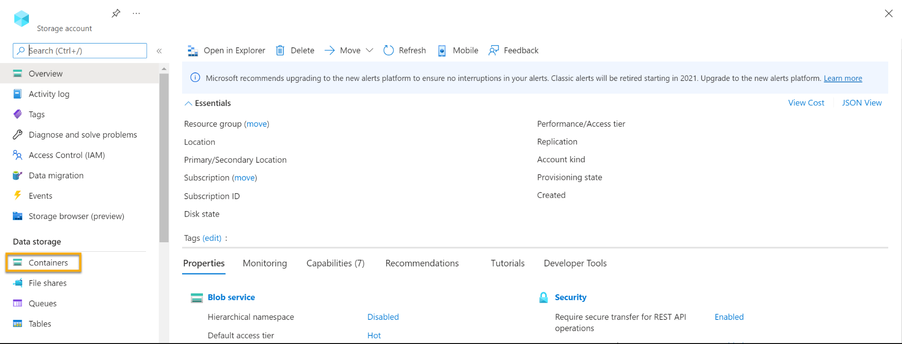
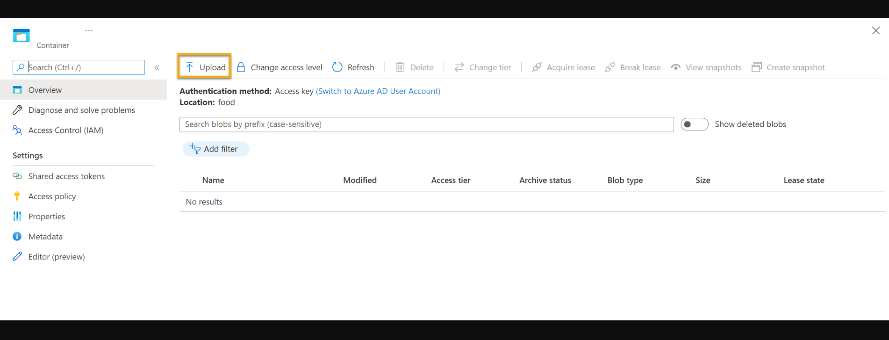
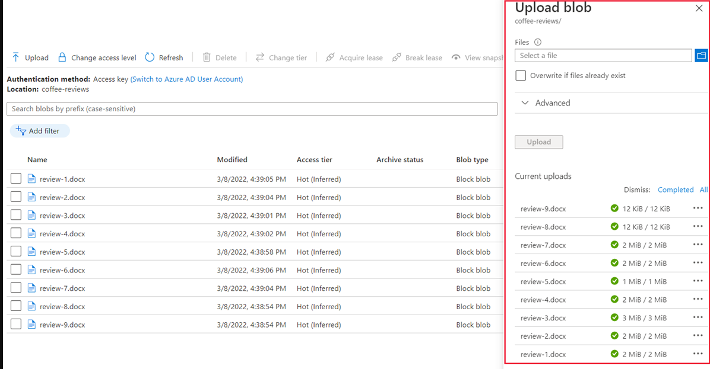

# Explore Azure AI Search index (UI)

Este é um tutorial de estudo solicitado pela Digital Innovation One - [DIO](https://www.dio.me/) para praticar os conceitos aprendidos no curso de 
Introdução ao Aprendizado de Máquina' [Microsoft Azure AI Fundamentals](https://web.dio.me/track/microsoft-azure-ai-fundamentals).

Neste exercício, você explorará os recursos Azure AI Search index.

## Pré-requisitos

* Ter uma conta no Microsoft Azure.

#### Se você não possui conta no Microsoft Azure siga os passos abaixo:

* Acesse o site da [Microsoft Azure](https://azure.microsoft.com/pt-br)
* Clique em Experimente gratuitamente.
* Será necessário colocar os dados de sua conta da Microsoft, caso não possua criar.
* Será necessário cadastrar um cartão de crédito para aderir ao plano gratuito.
* Você terá $200 dólares de crédito ou 30 dias para testar os serviços.

## Explorando Azure AI Search

1. Entre no [Portal da Azure](https://portal.azure.com) com suas credenciais da Microsoft.

2. Criando um recurso do Azure AI Search -> Na aba Azure Services procure por 'Criar recurso'.

3. Em categorias selecione o item Azure AI Search.

4. Abrirá um painel com algumas informações para preencher

        Assinatura: sua assinatura do Azure
        Grupo de recursos: Crie ou selecione um grupo de recursos da sua assinatura
        Nome: Insira um nome exclusivo para seu espaço de trabalho
        Região: Selecione a região geográfica mais próxima
        Tipo de preço: free F0
        Clicar em examinar e criar

5. Após a conclusão da implantação, selecione Ir para o recurso . Na página de visão geral do Azure AI Search, você pode adicionar índices, importar dados e pesquisar índices criados.

Para o proximo passo será necessário criar um recurso no serviços de IA do Azure

# Criando um recurso de serviços de IA do Azure

1. Você precisará criar um recurso de serviços de IA do Azure que esteja no mesmo local que seu recurso do Azure AI Search. Sua solução usará esse recurso para popular os dados no armazenamento de dados com insights gerados por IA.

2. Nágina inicial do portal do Azure, clique em "Criar um recurso" 

3. Selecione os serviços de IA do Azure.

4. Selecione criar um plano de serviços de IA do Azure.

5. Configure-o com as seguintes configurações:
        Assinatura : sua assinatura do Azure .
        Grupo de recursos : O mesmo grupo de recursos que seu recurso do Azure AI Search .
        Região : o mesmo local do recurso do Azure AI Search .
        Nome : Um nome exclusivo .
        Nível de preços : Padrão S0

6. Marcar em confirmo que li e compreendi todos os termos abaixo:

7. Selecione Revisar + criar.

8. Depois de ver a resposta Validation Passed , selecione Create .

9. Aguarde a conclusão da implantação e visualize os detalhes da implantação.

# Proxima etapa criar uma conta de armazenamento

1. Na página inicial do portal do Azure e selecione -> Criar um recurso .

2. Selecione conta de armazenamento

3. Crie um recurso de conta de armazenamento com as seguintes configurações:

        Assinatura : sua assinatura do Azure .
        Grupo de recursos : O mesmo grupo de recursos que os recursos do Azure AI Search e dos serviços Azure AI .
        Nome da conta de armazenamento : um nome exclusivo .
        Localização : Escolha qualquer localização disponível .
        Padrão de desempenho
        Redundância : armazenamento localmente redundante (LRS)
        Clique em Revisar e em Criar . Aguarde a conclusão da implantação e vá para o recurso implantado.

4. Na conta de Armazenamento do Azure criada, no menu esquerdo, selecione Configuração.

5. Altere para Habilitado a configuração de Permitir acesso anônimo de Blob.

6. Selecione Salvar.

# Carregar documentos para o armazenamento do Azure

1. No menu, selecione Containers.

2. Selecione + Contêiner

3. Insira as seguintes configurações e clique em Criar :
        Nome : Coffee-Reviews
        Nível de acesso público : Container (acesso de leitura anônimo para containers e blobs)
        Avançado : sem alterações .

4. Em uma nova guia do navegador, baixe as avaliações de café compactadas em https://aka.ms/mslearn-coffee-reviewse extraia os arquivos para a pasta de avaliações .

5. No portal do Azure, selecione o contêiner de avaliações de café . No contêiner, selecione Carregar .

6. No painel Carregar blob , selecione Selecionar um arquivo .

7. Na janela do Explorer, selecione todos os arquivos na pasta de avaliações , selecione Abrir e, em seguida, selecione Carregar .

### Indexar os documentos
1. Após  de armazenar os documentos, você poderá usar o Azure AI Search para extrair insights dos documentos.

2. No portal na página Visão geral , selecione Importar dados .

3. Captura de tela que mostra o assistente de importação de dados.

4. Selecione Azure Blob Storage.

5. Preencha os detalhes do armazenamento de dados com os seguintes valores:

        Fonte de dados : Armazenamento de Blobs do Azure
        Nome da fonte de dados : coffee-customer-data
        Dados a extrair : Conteúdo e metadados
        Modo de análise : Padrão
        Cadeia de conexão : *Selecione Escolha uma conexão existente -> Selecione sua conta de armazenamento -> selecione o contêiner de avaliações de café -> clique em Selecionar .
        Autenticação de identidade gerenciada : Nenhuma
        Nome do contêiner : esta configuração é preenchida automaticamente depois que você escolhe uma conexão existente .
        Pasta Blob : deixe em branco .
        Descrição : Avaliações sobre Fourth Coffee Shops.Selecione Próximo: Adicionar habilidades cognitivas (opcional) .

7. Na secção Anexar Serviços Cognitivos , selecione o seu recurso de serviços Azure AI.

8. Na seção Adicionar enriquecimentos :
* Altere o nome da qualificação para coffee-skillset .
* Marque a caixa de seleção Habilitar OCR e mesclar todo o texto no campo merged_content .
* Nota É importante selecionar Habilitar OCR para ver todas as opções de campo enriquecido.

9. Certifique-se de que o campo Dados de origem esteja configurado como merged_content .
* Altere o nível de granularidade de enriquecimento para Páginas (blocos de 5.000 caracteres) .
* Não selecione Habilitar enriquecimento incremental
* Selecione os seguintes campos enriquecidos:

# Deletando os serviços após o uso

O serviço web que você criou está hospedado em uma instância de contêiner do Azure . Se não pretender usa-lo, deverá eliminar para evitar utilização desnecessária do Azure.

Na pagina inicial do azure selecionar todos os recursos.

Excluir as instâncias não utilizadas, pois isso garante que sua assinatura não será cobrada por recursos..

Para excluir seu espaço de trabalho:

No portal Azure , na página Grupos de recursos , abra o grupo de recursos que especificou ao criar o seu espaço de trabalho na Azure.
Clique em Excluir grupo de recursos , digite o nome do grupo de recursos para confirmar que deseja excluí-lo e selecione Excluir .